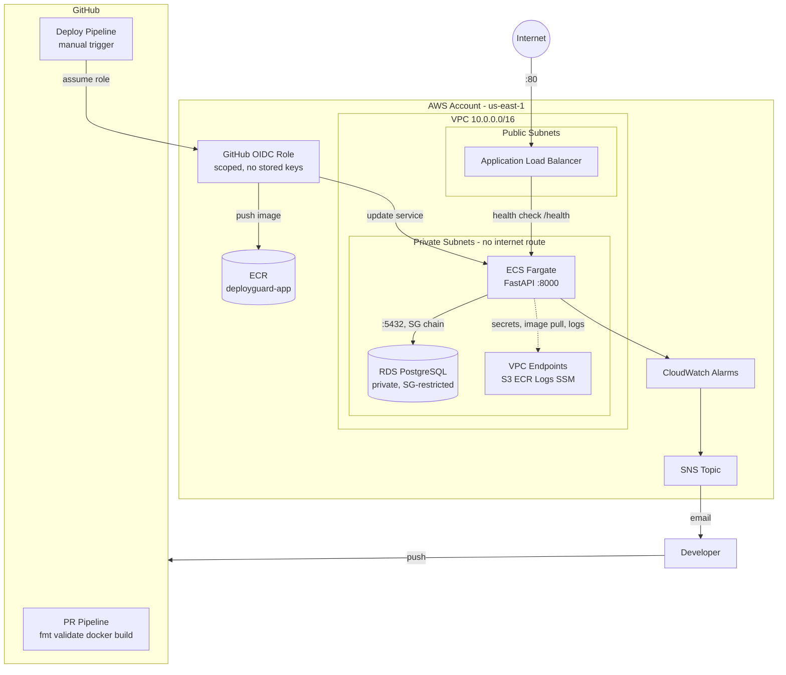

# DeployGuard

**A secure AWS deployment platform, provisioned entirely with Terraform � build, ship, and safely roll back a containerized application, with zero long-lived AWS credentials anywhere in the pipeline.**


Built by Ousmane Sanokho � BSc (Hons) Information Technology, Cloud Engineering, Asia Pacific University.

---

## What this project proves

Most student projects prove you can build an application. DeployGuard proves something different: **given a working application, I can build the infrastructure and delivery system that gets it into production securely, observes it, and recovers it automatically when something breaks.**

**Engineering narrative:** Provision -> Secure -> Deploy -> Validate -> Observe -> Detect Failure -> Rollback -> Reproduce

Every piece of this repository is real, live infrastructure � not a diagram of what *could* be built. It was provisioned, broken on purpose, debugged, and fixed using the actual AWS console, CLI, and CloudWatch Logs, not simulated.

---

## Architecture



**No NAT Gateway.** Private subnets have zero route to the general internet � only narrow VPC Endpoints to the specific AWS APIs the app actually needs (ECR, CloudWatch Logs, SSM, S3). This was a deliberate least-privilege networking decision, not a cost shortcut.

---

## What's actually implemented

| Layer | Components |
|---|---|
| **Infrastructure as Code** | 100% Terraform - VPC, subnets, routing, IAM, compute, data, CI identity. Remote state in S3 with native locking. |
| **Networking** | VPC, 2 public + 2 private subnets across 2 AZs, Internet Gateway, 5 VPC Endpoints (S3 gateway + ECR/Logs/SSM interface) |
| **Security** | 3-tier Security Group chain (ALB -> ECS -> RDS, badge-based, not CIDR), RDS `publicly_accessible = false`, least-privilege IAM (execution role vs. task role, separately scoped) |
| **Compute** | ECS on Fargate, FastAPI application, Docker, ECR |
| **Data** | RDS PostgreSQL, auto-generated password stored in SSM Parameter Store (SecureString), never hardcoded |
| **Load Balancing** | Application Load Balancer, health-check-driven target group |
| **CI/CD** | GitHub Actions - separate PR-validation and deploy pipelines, GitHub OIDC authentication (no stored AWS keys, ever) |
| **Deployment Safety** | ECS deployment circuit breaker with automatic rollback on failed health checks |
| **Observability** | CloudWatch Logs, 2 metric alarms (unhealthy targets, 5xx errors), SNS email notifications |

---

## Key engineering decisions

| Decision | Why |
|---|---|
| ECS Fargate, not EKS | Full container orchestration without the operational overhead of managing a Kubernetes control plane - appropriately scoped for the project's timeline and goals |
| VPC Endpoints, not NAT Gateway | Private subnets stay unreachable from the general internet entirely, not just firewalled - a stronger security posture than a NAT Gateway provides |
| SSM Parameter Store, not Secrets Manager | Free tier; automatic rotation wasn't needed for this project's scope |
| Manual `workflow_dispatch` deploy trigger | GitHub's native "required reviewers" approval gate is Enterprise-only for private repos on this plan tier - manual triggering is the deliberate substitute approval mechanism |
| HTTP only, no custom domain | No domain was purchased specifically to avoid the cost - documented as a known, deliberate limitation, not an oversight |
| Single-AZ RDS | Cost/complexity trade-off appropriate for a portfolio project; documented, not hidden |

---

## Real engineering problems solved

These were genuine failures encountered and debugged during development � not staged examples.

- **ECS tasks failed to start** with a timeout error retrieving secrets from SSM. Root cause: the VPC had endpoints for ECR/S3/Logs but not SSM - a real gap in the original networking build, invisible until secret injection was actually exercised. Fixed by adding the missing endpoint and forcing a new ECS deployment.
- **ECR authentication failed** with a `400 Bad Request` on the standard, AWS-documented `docker login` command - confirmed via research to be a known tooling bug, not a local misconfiguration. Resolved by installing the official Amazon ECR Credential Helper, which authenticates through a different mechanism entirely.
- **GitHub Actions OIDC authentication was rejected** with "not authorized." Rather than guessing, I added a temporary step to decode the real OIDC token and read its actual claims - which revealed GitHub's newer subject format embeds immutable numeric owner/repo IDs alongside the names. Corrected the IAM trust policy to match the real, confirmed value.

---

## CI/CD pipelines

**PR Checks** (`.github/workflows/pr-checks.yml`) - runs on every pull request: `terraform fmt`, `terraform validate` (no AWS credentials present at all, by design - a PR pipeline should never have cloud access), and a Docker build check.

**Deploy** (`.github/workflows/deploy.yml`) - manually triggered: authenticates to AWS via GitHub OIDC (zero stored credentials), builds and pushes the image to ECR (tagged with the Git commit SHA for full traceability), updates the ECS service, and waits for the deployment to report genuinely stable before finishing.

---

## Reliability & failure engineering

The ECS deployment circuit breaker (automatic rollback on failed health checks) is implemented and live. Formal, deliberately-injected failure scenarios - run and documented as runbooks - are in progress:

- [ ] Bad deploy -> automatic rollback
- [ ] RDS connectivity failure via a deliberately broken security group rule
- [ ] IAM least-privilege failure
- [ ] Terraform drift detection
- [ ] Full `terraform destroy` -> recreate (reproducibility proof)

---

## Repository structure

```
deployguard/
|-- app/                          # FastAPI application + Dockerfile
|-- infrastructure/
|   |-- backend/                  # One-time bootstrap: Terraform state bucket
|   +-- environments/dev/         # Main infrastructure (all resources above)
+-- .github/workflows/
    |-- pr-checks.yml
    +-- deploy.yml
```

---

## Cost design

Built with a near-$0 target: VPC Endpoints instead of a NAT Gateway, `db.t4g.micro` single-AZ RDS, SSM Parameter Store instead of Secrets Manager, and a strict `terraform destroy` discipline between working sessions.

---

## Running this yourself

Requires an AWS account and Terraform >= 1.11.

```
cd infrastructure/backend && terraform init && terraform apply   # one-time state bucket
cd ../environments/dev && terraform init && terraform apply      # full environment
```

---

*Part of a three-project portfolio: **CloudRescue** (monitoring & automated recovery, EC2/Docker) -> **AI Internship Copilot** (full-stack AI SaaS, Next.js/Supabase) -> **DeployGuard** (the infrastructure and delivery system that gets an application into production).*


